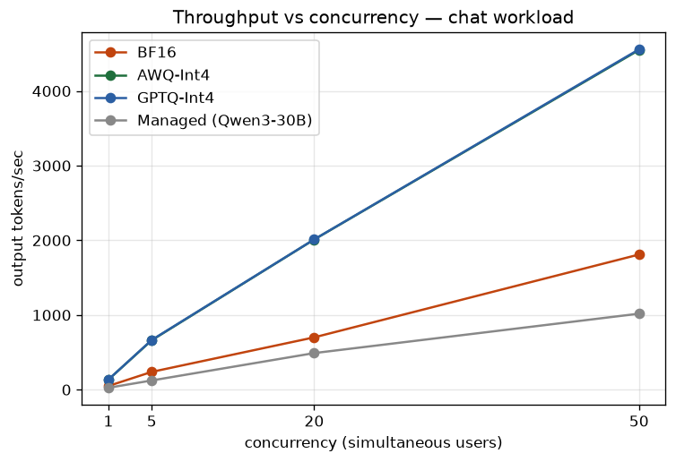
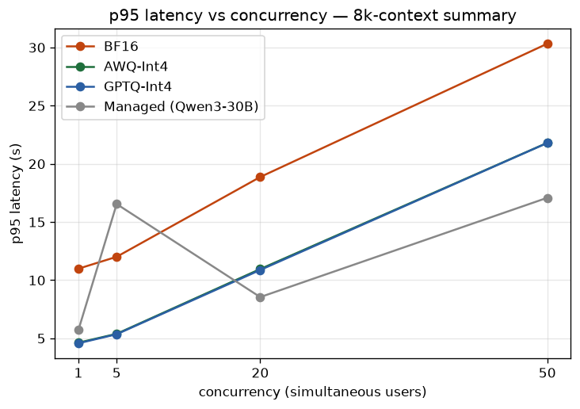
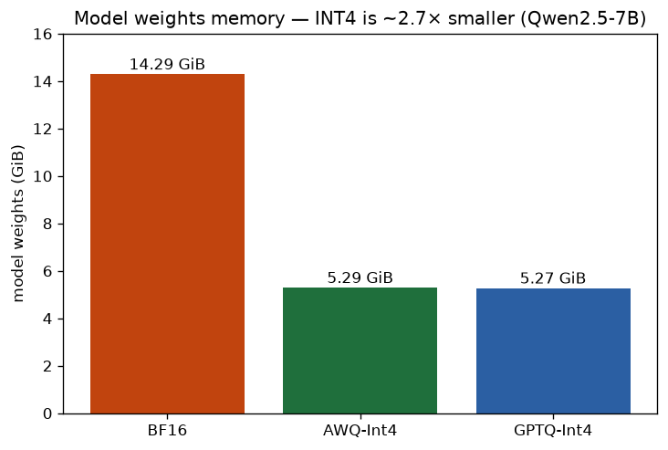
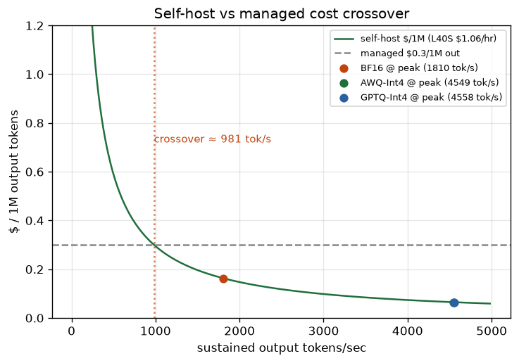

# LLM Quantization & Inference Benchmark Lab

Benchmarking **FP16/BF16 vs AWQ-Int4 vs GPTQ-Int4** for serving an open-source LLM
on **vLLM**, against a **managed token API** (Nebius Token Factory) — measuring
latency, throughput, GPU memory, quality, and cost across realistic workloads and
concurrency, then making a production recommendation.

> **Headline:** On an NVIDIA L40S, AWQ/GPTQ Int4 served **~2.5× the throughput** of
> BF16 with **2.7× smaller weights** (5.3 vs 14.3 GiB) and **~39% more KV-cache
> headroom**, while retaining **99.8%** of BF16's RAG grounding quality. For this
> workload, **the quantized model is the production choice.**

---

## Problem

We need to serve Qwen2.5-7B-Instruct for production GenAI workloads (interactive
chat, RAG answering, long-context summarization) and answer a concrete buyer's
question: **should we self-host a quantized model — and in which format — or pay
for a managed token API?** This repo answers it with reproducible measurements, not
vendor claims.

## TL;DR findings

- **AWQ ≈ GPTQ — a statistical tie** on throughput, latency, and memory across all
  12 cells. The Int4 format choice is about checkpoint quality/availability, not
  serving performance.
- **Int4 is ~2.5× faster than BF16** at high concurrency (chat @50: 4,549 vs 1,810
  tok/s) — the weight-only-Int4 win on decode memory bandwidth.
- **Memory:** Int4 weights are 5.3 GiB vs BF16's 14.3 GiB; at the same GPU
  utilization that frees ~39% more KV cache (632k vs 455k tokens → **68× vs 50×**
  concurrent full-context sequences).
- **Quality holds:** AWQ retained **99.8%** of BF16's RAG grounding (0.987 vs
  0.988) — quantization did not meaningfully degrade faithfulness.
- **Cost crossover ≈ 981 output tok/s:** above it, self-host beats the managed API
  on \$/token. At peak utilization self-hosted AWQ costs **~\$0.065 / 1M output
  tokens** vs the managed **\$0.30 / 1M** (different model — see Limitations).

## Setup

| | |
|---|---|
| **Model (self-host)** | `Qwen/Qwen2.5-7B-Instruct` + official `-AWQ` / `-GPTQ-Int4` checkpoints |
| **Model (managed)** | `Qwen/Qwen3-30B-A3B-Instruct-2507` on Nebius Token Factory (closest available — they don't host 7B) |
| **Hardware** | 1× NVIDIA L40S (48 GiB), vLLM 0.23.0, \$1.06/hr |
| **Serving knobs** | `--max-model-len 9216`, `--gpu-memory-utilization 0.90`, `--max-num-seqs 64`, chunked prefill |
| **Workloads** | chat (200→100 tok), RAG (2k→300), long summary (8k→500) |
| **Concurrency** | 1, 5, 20, 50 simultaneous users |
| **Per cell** | 5 warmup (discarded) + 50 measured requests |

## Methodology

- **Latency reported as p50/p95/p99**, computed over *successful* requests only;
  failures counted separately in `error_rate` (all cells ran at **0% errors**).
- **Fixed output length** on self-host via `ignore_eos` + `max_tokens`, so
  tokens/sec is comparable across formats. (Managed APIs reject `ignore_eos`, so
  managed output length is natural — a documented asymmetry.)
- **Pinned datasets** (SQuAD v2 for RAG, GovReport for long summary, a curated
  structured-prompt set), fixed indices, seed 1234, greedy decoding (`temperature=0`).
- **Throughput** = total output tokens ÷ measured-batch wall-clock (captures
  aggregate system throughput under concurrency).
- One OpenAI-compatible async client drives **both** vLLM and the managed API —
  identical harness, only `base_url` changes.

## Results

### Performance @ concurrency 50 (output tokens/sec · p95 latency)

| Workload | BF16 | AWQ-Int4 | GPTQ-Int4 | Managed (Qwen3-30B) |
|---|---|---|---|---|
| chat | 1,810 · 2.75s | **4,549 · 1.09s** | **4,558 · 1.09s** | 1,018 · 1.24s |
| rag | 1,833 · 8.18s | 4,616 · 3.24s | **4,721 · 3.17s** | 422 · 1.11s |
| summary (8k) | 823 · 30.3s | 1,145 · 21.8s | 1,145 · 21.8s | 1,462 · 17.1s |




Int4 dominates BF16 everywhere. On the 8k-context summary at high concurrency the
managed 30B model actually scales *better* on latency (bigger, undisclosed infra)
— but you pay per token and don't control it.

### GPU memory



| Format | Weights | KV-cache size | Max concurrency (9216-tok reqs) |
|---|---|---|---|
| BF16 | 14.29 GiB | 455,184 tok | 49–51× |
| AWQ-Int4 | 5.29 GiB | 632,160 tok | 68.6× |
| GPTQ-Int4 | 5.27 GiB | ~AWQ | 67.0× |

### Quality (RAG grounding/faithfulness, LLM-judged, vs BF16 baseline)

| Format | Grounding | Retained |
|---|---|---|
| BF16 | 0.988 | 100% (baseline) |
| AWQ-Int4 | 0.987 | **99.8%** |

### Cost



Self-host \$/1M-output = GPU \$/hr ÷ sustained throughput, so it's
utilization-driven. **Crossover ≈ 981 tok/s**: below it, the managed per-token
price wins; above it, self-host wins. Quantized formats operate far above the
crossover at scale.

## Recommendation

- **Latency-sensitive chat/RAG → self-host AWQ (or GPTQ).** ~2.5× the throughput of
  BF16, sub-second TTFT, ~equal quality, and the lowest \$/token above the
  crossover. The production default for this workload.
- **AWQ vs GPTQ → a coin flip on serving;** decide on checkpoint quality and
  availability. Both ship as official Qwen checkpoints.
- **BF16 → only when a workload demands full-precision quality.** Here AWQ held
  99.8% of grounding, so BF16's quality premium wasn't needed.
- **Managed API → low/spiky traffic, speed-to-market, small ops team,** or
  long-context at high concurrency where the larger managed model scaled better —
  accepting per-token cost and a black-box stack.

## Limitations (stated honestly)

- **Managed is a different model.** Token Factory doesn't offer Qwen2.5-7B, so the
  managed reference is Qwen3-30B-A3B. The managed comparison is therefore
  "self-hosted small quantized vs managed larger model" — a real procurement
  question, not a same-model serving comparison.
- **Managed is a black box:** precision (likely FP8), hardware, and batching are
  not observable, and GPU memory can't be measured — `gpu_mem_gb` is null for
  managed cells. Reported managed numbers are *delivered* price/performance,
  including internet round-trip.
- **Cost model is deliberately simple:** it captures the dominant factor
  (utilization) but omits ops/engineering time, idle time between bursts, and
  redundancy; the managed price is output-token-only.
- **Quality eval is partial:** RAG grounding for BF16/AWQ. GPTQ quality wasn't
  captured but is performance-identical to AWQ; chat JSON-validity and summary
  scoring are wired but not yet run across all formats.
- **Single L40S, no tensor-parallel** (7B doesn't need it).

## Reproduce

```bash
pip install -e ".[dev]"
python -m pytest -m "not network" -q          # 36 unit tests

# managed run (needs NEBIUS_API_KEY in .env.local)
python scripts/run_managed.py --sweep configs/sweep.yaml

# self-host run (on a GPU host — see docs/RUNBOOK_BREV.md)
bash serve/launch_awq.sh &
python scripts/run_selfhost.py --only awq

# regenerate charts from committed results
python scripts/generate_report.py --gpu-hr 1.06 --managed-per-1m 0.30
```

Design, plan, methodology deep-dive, and the concept/reference guide are in
[`docs/`](docs/): [spec](docs/DESIGN.md),
[testing & results](docs/TESTING.md), [GPU runbook](docs/RUNBOOK_BREV.md).
